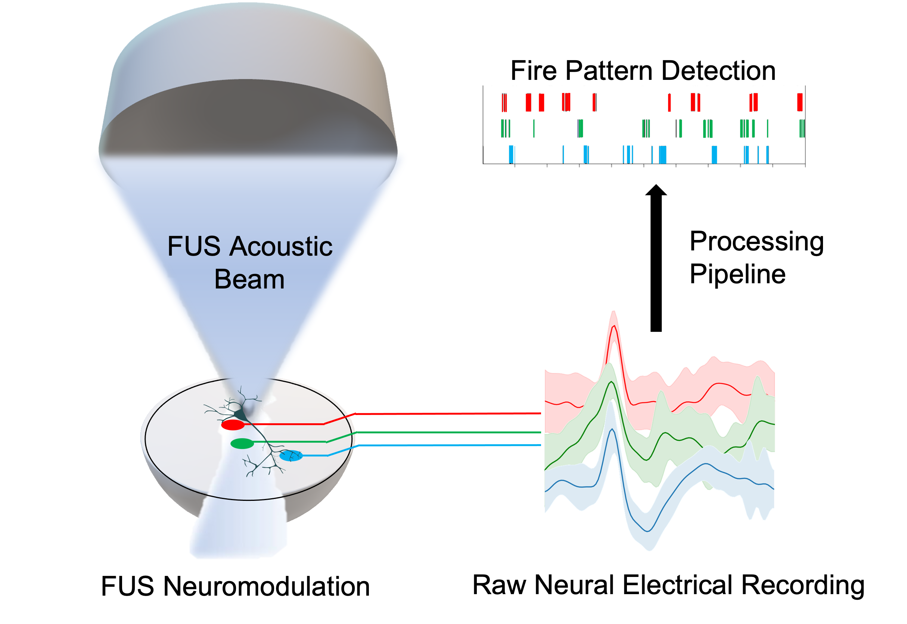

# FUSNeuromod [](https://colab.research.google.com/github/Rxliang/FUSNeuromod/blob/main/MEA_analysis.ipynb)


Ruixing Liang


Work in Process repo for post-processing neuronal response data



if you find this is useful in your work, please cite our work as:

```
@article{liang_focused_2023,
	title = {Focused Ultrasound Neuromodulation of Human In Vitro Neural Cultures in Multi-Well Microelectrode Arrays},
	doi = {TBD},
	pages = {e65115},
	journaltitle = {{JoVE} (Journal of Visualized Experiments)},
	author = {Liang, Ruixing and Mess, Griffin and Punnoose, Joshua and Leadingham, Kelley and Smit, Constatin and Habela, Christa and Thakor, Nitish and Tyler, Betty and Salimpour, Yosef and Manbachi, Amir},
}
```

